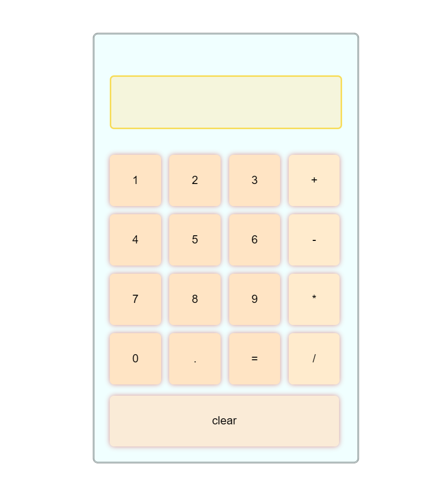

# 简易网页计算器
## 1.功能
- 支持简单的加减乘除功能
- 支持小数、整数
- 支持连续符号输入取后者
- 支持单纯符号输入判错提示、除数为 0 判错提示
## 2.快速开始
1. 下载 `caculator.html` `caculator.css` `caculator.js` 在同一个文件夹下
2. 双击 `caculator.html` 快速开始
## 文件说明
| 文件名     |   作用  |
|:-------------|:-------------|
|caculator.html|页面结构|
|caculator.css|样式设计、布局设置|
|caculator.js|计算逻辑|
## 运行截图

## 待办
- [ ] 次幂运算
- [ ] 开方运算
- [ ] 对数运算
- [ ] 历史纪录显示

